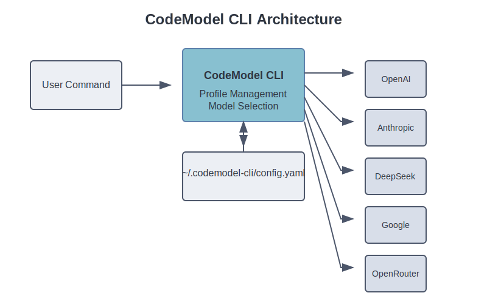

<div align="center">
  

  [](https://github.com/cristianoaredes/codemodel-cli/releases)
  [](LICENSE)
  [](https://nodejs.org/)
  [](https://github.com/cristianoaredes/codemodel-cli/blob/master/.github/CONTRIBUTING.md)
  
  **A unified command-line interface for managing and switching between AI code models**
</div>

---

## 📋 Table of Contents
- [Overview](#-overview)
- [Key Features](#-key-features)
- [Quick Start](#-quick-start-2-minute-setup)
- [Installation](#-installation)
- [Usage Examples](#-usage-examples)
- [Configuration](#️-configuration)
- [Supported AI Models](#-supported-ai-models)
- [How It Works](#️-how-it-works)
- [Comparison](#-comparison-with-similar-tools)
- [Roadmap](#️-roadmap)
- [Building and Distribution](#-building-and-distribution)
- [Contributing](#-contributing)
- [Community & Support](#-community--support)
- [System Requirements](#-system-requirements)
- [Author](#-author)
- [Troubleshooting](#-troubleshooting)
- [License](#-license)

## 🔍 Overview

CodeModel CLI (`cw`) provides a **single unified interface** for working with multiple AI code models from different providers. Instead of learning different CLIs for each AI service, you can define profiles for your preferred provider/model combinations and seamlessly switch between them, maintaining a consistent workflow.

Whether you're using OpenAI's GPT-4, Anthropic's Claude, Google's Gemini, or any other AI coding assistant, CodeModel CLI simplifies your development process with AI.

## ✨ Key Features

- **Multi-Provider Support**: Work with any AI code model provider through a single interface
- **Profile Management**: Easily create, update, and switch between different AI model configurations
- **Interactive Selection**: Choose profiles via an intuitive command-line interface
- **Automatic Installation**: Dependencies are installed on demand when needed
- **Workflow Integration**: Seamlessly integrate with your existing development tools
- **Cross-Platform Compatibility**: Works on macOS, Linux, and Windows
- **Extensive Documentation**: Comprehensive guides and examples for all use cases

## 🚀 Quick Start (2-minute setup)

1️⃣ **Install globally**:
```bash
npm install -g codemodel-cli
```

2️⃣ **Create your first profile**:
```bash
cw add myprofile --interactive
```

3️⃣ **Start using it**:
```bash
cw "Write a function that sorts an array"
```

That's it! You're now using CodeModel CLI! 🎉

## 📥 Installation

### Using NPM (Recommended)

```bash
# Install globally
npm install -g codemodel-cli
```

### Using the DMG Installer (macOS)

1. Download the latest DMG file from the [releases page](https://github.com/cristianoaredes/codemodel-cli/releases)
2. Open the DMG file
3. Run the `install.sh` script by double-clicking it

### From Source

```bash
# Clone the repository
git clone https://github.com/cristianoaredes/codemodel-cli.git
cd codemodel-cli

# Install dependencies
npm install

# Link for development
npm link

# Set up default profiles (optional)
./scripts/setup-profiles.sh
```

## 📝 Usage Examples

### Profile Management

```bash
# Add a new profile with specific provider and model
cw add openai-profile --provider openai --model gpt-4.1

# Add a profile interactively with guided prompts
cw add claude-profile --interactive

# List all available profiles
cw list

# Set a profile as active
cw use openai-profile

# Select a profile interactively
cw select

# Remove a profile
cw remove old-profile
```

### AI Code Generation Workflows

```bash
# Generate code with active profile
cw "Create a React component that shows a countdown timer"

# Compare outputs from different models
cw use openai-profile
cw "Implement a binary search tree in Python" > openai-solution.py

cw use claude-profile
cw "Implement a binary search tree in Python" > claude-solution.py

# Run with specific profile for one-time use
cw run --profile deepseek-profile "Optimize this function for performance: function fib(n) { ... }"
```

### Integration with Dev Tools

```bash
# In your shell scripts
function ask_ai() {
  cw use openai-profile
  cw "$1" > "$2"
}

# Usage
ask_ai "Create a unit test for this function" test.js
```

## ⚙️ Configuration

Configuration is stored in `~/.codemodel-cli/config.yaml` with a simple structure:

```yaml
active: openai-profile  # Currently active profile
profiles:
  openai-profile:
    provider: openai
    model: gpt-4.1
  claude-profile:
    provider: anthropic
    model: claude-3.7-sonnet
  # Additional profiles...
```

## 🤖 Supported AI Models

| Provider | Default Model | Best For | Response Speed | Code Quality |
|----------|---------------|----------|---------------|---------|
| OpenAI | `gpt-4.1` | Complex code generation | ⚠️ Medium | ⭐⭐⭐⭐⭐ |
| Google | `gemini-2.5-pro` | Scientific coding | ⚠️ Medium | ⭐⭐⭐⭐⭐ |
| Anthropic | `claude-3.7-sonnet` | Code explanation | ✅ Fast | ⭐⭐⭐⭐⭐ |
| DeepSeek | `deepseek-coder-v3` | Algorithmic solutions | ✅ Fast | ⭐⭐⭐⭐ |
| Mistral | `mistral-codestral-2501` | Low-latency tasks | ✅ Very fast | ⭐⭐⭐⭐ |
| Qwen | `qwen2.5-coder-32b` | Multilingual code | ⚠️ Medium | ⭐⭐⭐⭐ |
| OpenRouter | `agentica-org/deepcoder-14b-preview` | Free tier usage | ✅ Fast | ⭐⭐⭐⭐ |

## 🏗️ How It Works

<div align="center">
  
</div>

CodeModel CLI acts as a central hub for all your AI code model interactions:

1. **User Interface**: Provides a consistent command-line experience
2. **Profile Management**: Stores and manages your provider/model configurations
3. **Provider Routing**: Directs your requests to the appropriate AI service
4. **Response Handling**: Returns formatted responses from the AI models

## 🔄 Comparison with Similar Tools

| Feature | CodeModel CLI | Provider-Specific CLIs | Other Wrappers |
|---------|---------------|------------------------|----------------|
| Multi-provider support | ✅ | ❌ | ⚠️ Limited |
| Profile management | ✅ | ❌ | ⚠️ Some |
| Interactive selection | ✅ | ❌ | ⚠️ Few |
| Auto-installation | ✅ | ❌ | ❌ |
| DMG installer | ✅ | ❌ | ❌ |
| Open source | ✅ | ⚠️ Some | ⚠️ Some |
| Customization options | ✅ | ⚠️ Limited | ⚠️ Varies |

## 🛣️ Roadmap

- [ ] API key management and secure storage
- [ ] Provider-specific configuration options
- [ ] Performance benchmarks for model comparison
- [ ] Batch processing mode
- [ ] Plugin system for extended functionality
- [ ] Web UI for configuration management
- [ ] Response formatting options (JSON, Markdown, etc.)
- [ ] Local model support (Ollama, llama.cpp)

## 📦 Building and Distribution

To build a DMG installer for macOS distribution:

```bash
npm run build-dmg
```

The DMG file will be created in the `dist` directory.

## 🤝 Contributing

Contributions are welcome! Here's how you can help improve CodeModel CLI:

1. Fork the repository
2. Create a feature branch: `git checkout -b feature/amazing-feature`
3. Make your changes and commit them: `git commit -m 'Add amazing feature'`
4. Push to the branch: `git push origin feature/amazing-feature`
5. Open a pull request

Please see our [contributing guidelines](.github/CONTRIBUTING.md) for more details.

## 👥 Community & Support

Join our community to get help, share ideas, and contribute:

- [GitHub Discussions](https://github.com/cristianoaredes/codemodel-cli/discussions)
- [Report Bugs](https://github.com/cristianoaredes/codemodel-cli/issues)
- [Feature Requests](https://github.com/cristianoaredes/codemodel-cli/issues)
- [Contributing Guide](.github/CONTRIBUTING.md)

## 💻 System Requirements

- **Node.js**: v14.0.0 or higher
- **npm**: v6.0.0 or higher
- **Operating Systems**: macOS, Linux, Windows
- **Disk Space**: Minimal (<5MB)
- **Dependencies**: Internet connection for AI model access

## 👤 Author

**Cristiano Aredes**

- GitHub: [@cristianoaredes](https://github.com/cristianoaredes)
- LinkedIn: [@cristianoaredes](https://www.linkedin.com/in/cristianoaredes/)

## ❓ Troubleshooting

### Common Issues

**Q: The `cw` command is not found after installation**  
A: Ensure your global npm bin directory is in your PATH. You can check with `npm bin -g`.

**Q: I get an error about codex not being installed**  
A: The tool should automatically install codex, but if it fails, you can install it manually with `npm install -g @openai/codex`.

**Q: How do I update to the latest version?**  
A: Run `npm update -g codemodel-cli`.

**Q: Can I use multiple profiles in a single script?**  
A: Yes! You can specify different profiles with each command using `--profile name`.

## 📄 License

This project is licensed under the MIT License - see the [LICENSE](LICENSE) file for details.

---

<div align="center">
  <sub>Built with ❤️ by <a href="https://github.com/cristianoaredes">Cristiano Aredes</a> | <a href="https://www.linkedin.com/in/cristianoaredes/">LinkedIn</a></sub>
</div>
